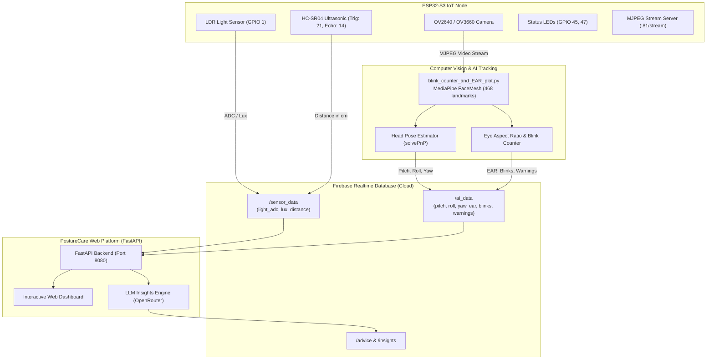

# PostureCare - Smart Ergonomic Health & Posture Monitoring System

An end-to-end intelligent IoT & AI workspace monitoring system designed to protect user ergonomics, prevent eye strain, and encourage healthy sitting habits. The system integrates **ESP32-S3 hardware sensors & camera streaming**, **MediaPipe computer vision AI for face & blink tracking**, **Firebase Realtime Database**, and a **FastAPI Web Dashboard with LLM health insights**.

---

## 📐 System Architecture



---

## ✨ Key Features

1. **AI Vision & Head Pose Tracking (`tracking_AI/`)**:
   - **Blink Tracking & EAR**: Measures Eye Aspect Ratio (EAR) in real time to calculate blink frequency and detect eye fatigue.
   - **Head Pose Estimation (solvePnP)**: Calculates precise Pitch, Roll, and Yaw angles relative to the camera with dynamic 3D head axes visualization.
   - **Interpupillary Distance (IPD)**: Estimates distance from eyes to the screen in centimeters with instant 1-click calibration.
   - **Instant Ergonomic Alerts**: Triggers real-time alerts when tilting head down/up (>15°), tilting off-axis (>15°), or sitting too close (<40cm).

2. **IoT Sensor & Camera Firmware (`firmware/`)**:
   - **ESP32-S3 Camera Server**: High-speed MJPEG video streaming at `http://<ESP32_IP>:81/stream`.
   - **Ambient Light Monitoring**: LDR sensor converts analog reading into calibrated Lux values.
   - **Ultrasonic Distance Measurement**: Measures workspace obstacle clearance using HC-SR04.
   - **Direct Cloud Sync**: Publishes sensor readings to Firebase Realtime Database every 2 seconds.

3. **Intelligent Web Dashboard & LLM Insights (`dashboard/gPBL/`)**:
   - **Real-Time Visualization**: HUD metrics, 3D attitude visualizers, sensor dials, and alert feeds.
   - **Rule Evaluation Engine**: Customizable thresholds for posture, lighting, and viewing distance via `data/rules.json`.
   - **AI Ergonomic Advisor**: Generates context-aware health advice and sitting habit summaries powered by LLMs (OpenRouter API with heuristic fallback).

---

## 📁 Repository Structure

```
gpbl/
├── firmware/                   # ESP32-S3 PlatformIO embedded project
│   ├── include/
│   │   ├── camera_pins.h       # Pin configuration for ESP32-S3-EYE / AI-Thinker
│   │   ├── firebase_manager.h  # Firebase RTDB client declarations
│   │   └── sensor_manager.h    # Sensor pinout & calculation definitions
│   ├── src/
│   │   ├── app_httpd.cpp       # Camera web server implementation
│   │   ├── firebase_manager.cpp# Anonymous auth & data upload logic
│   │   ├── main.cpp            # Main setup() and loop() routines
│   │   └── sensor_manager.cpp  # ADC, Lux & ultrasonic distance drivers
│   ├── platformio.ini          # PlatformIO environment & build flags
│   └── README.md               # Firmware specific documentation
│
├── tracking_AI/                # Python Computer Vision & Tracking Engine
│   ├── blink_counter.py        # Lightweight blink & head pose tracker
│   ├── blink_counter_and_EAR_plot.py # Comprehensive tracker with real-time EAR graph
│   ├── FaceMeshModule.py       # MediaPipe FaceMesh wrapper
│   ├── utils.py                # Video threading and UI drawing utilities
│   ├── requirements.txt        # Python dependencies for CV tracking
│   └── README.md               # Tracking module documentation
│
├── dashboard/gPBL/             # Web Platform & Backend Service
│   ├── backend/
│   │   ├── routers/            # FastAPI REST and WebSocket endpoints
│   │   ├── detectors.py        # Posture & environmental risk rules engine
│   │   ├── firebase_client.py  # Firebase Admin SDK communication
│   │   ├── llm_service.py      # OpenRouter LLM ergonomic advice engine
│   │   ├── main.py             # FastAPI application entrypoint
│   │   ├── requirements.txt    # Backend dependencies
│   │   └── static/             # Frontend UI assets, CSS, JS & sounds
│   ├── run.ps1                 # 1-click Windows startup script
│   ├── run.sh                  # 1-click Linux/macOS startup script
│   ├── run.bat                 # Windows batch launcher
│   └── README.md               # Dashboard specific guide
│
├── run.sh                      # Root macOS/Linux launcher (dashboard + tracking)
├── run.ps1                     # Root Windows launcher (dashboard + tracking)
├── platformio.ini              # Root PlatformIO workspace configuration
└── README.md                   # Main project documentation (this file)
```

---

## 🔌 Hardware Setup & Pinout

### ESP32-S3 Pin Mapping

| Component | Pin Type | ESP32-S3 GPIO | Description |
|---|---|---|---|
| **LDR (Light Sensor)** | ADC Analog | `GPIO 1` | 12-bit ADC reading (0 - 4095) |
| **HC-SR04 Ultrasonic Trig** | Digital Output | `GPIO 21` | Ultrasonic trigger pulse (10µs) |
| **HC-SR04 Ultrasonic Echo** | Digital Input | `GPIO 14` | Ultrasonic pulse width measurement |
| **Red Warning LED** | Digital Output | `GPIO 47` | Ergonomic violation indicator |
| **Green Status LED** | Digital Output | `GPIO 45` | Safe status indicator |
| **On-board Flash LED** | PWM Output | `GPIO 48` / `LED_GPIO_NUM` | Camera illumination |
| **Camera Module** | DVP Parallel | S3-EYE standard | Refer to `firmware/include/camera_pins.h` |

---

## 🚀 Quick Start (clone / pull → run)

**Python 3.10–3.12** is required for the full stack (MediaPipe). **3.11 is recommended.** Python 3.13 is **not** supported for `tracking_AI`.

The supported way to run the project is from the **repo root** with `run.ps1` (Windows) or `run.sh` (macOS / Linux). Do **not** `pip install` globally.

> Recent functional changes are summarized in [`UPDATE.md`](UPDATE.md).

### 1. Get the code

```bash
git clone <repo-url>
cd GBPL
```

Already have the repo? After pulling new commits:

```bash
git pull
```

No extra manual install step is needed on pull — the launcher reuses existing venvs and only reinstalls dependencies when `requirements.txt` changes.

### 2. One-time secrets (required before first run)

| File | What to do |
|---|---|
| `dashboard/gPBL/backend/serviceAccountKey.json` | **Required.** Firebase Console → Project Settings → Service accounts → **Generate new private key**. Save the JSON here. The launcher will **not** create a fake key. |
| `dashboard/gPBL/backend/.env` | Auto-copied from `.env.example` on first run. Edit `OPENROUTER_API_KEY` if you want real LLM advice (optional — mock advice works without it). |
| `dashboard/gPBL/backend/data/rules.json` | Auto-copied from `data/rules.json.example` on first run. Edit posture / lighting thresholds if needed. |

### 3. Run full stack (dashboard + AI tracking)

From the **repo root**:

**Windows (PowerShell):**
```powershell
.\run.ps1
```

**macOS / Linux:**
```bash
chmod +x run.sh && ./run.sh
```

What the launcher does automatically:

1. Creates / reuses two virtual environments:
   - `dashboard/gPBL/backend/.venv` — FastAPI backend
   - `tracking_AI/.venv` — MediaPipe / OpenCV tracking
2. Installs Python dependencies when `requirements.txt` changes
3. Starts FastAPI on port **8080**
4. Launches AI tracking in the foreground

**Camera source** (optional first argument, default `0` = built-in webcam):

```powershell
# Webcam index 0
.\run.ps1 0

# ESP32 MJPEG stream
.\run.ps1 http://192.168.1.50:81/stream
```

```bash
./run.sh 0
./run.sh http://192.168.1.50:81/stream
```

**Open in browser:**

- Dashboard: [http://localhost:8080/dashboard](http://localhost:8080/dashboard)
- API docs: [http://localhost:8080/docs](http://localhost:8080/docs)

**In the tracking window:**

- **`c`** — calibrate baseline head pose (0°) and eye distance
- **`p`** — quit tracking (dashboard stops too)

**In the web UI:**

1. Click **Start Camera** and follow the 4-step wizard (preview → calibrate → enter dashboard).
2. **Stop Stream = Stop Session** — ends the session, turns off LEDs, and can generate a session report.

**macOS Camera:** grant Camera access to the **parent app** (Terminal, iTerm, VS Code, or Cursor) under System Settings → Privacy & Security → Camera. If access is denied, tracking stays up with a “CONNECTING…” placeholder; it does not exit.

### 4. Dashboard-only (optional)

If you only need the web UI (no MediaPipe), run from `dashboard/gPBL/`:

```powershell
cd dashboard\gPBL
.\run.ps1
```

```bash
cd dashboard/gPBL
chmod +x run.sh && ./run.sh
```

Python **3.13** is allowed here. You still need `backend/serviceAccountKey.json`.

### 5. Flash firmware to ESP32-S3 (optional hardware)

Only needed if you use real ESP32 sensors / LED feedback / MJPEG camera stream.

1. Open the project in VS Code with the **PlatformIO** extension.
2. Edit WiFi credentials in [`firmware/src/main.cpp`](firmware/src/main.cpp):
   ```cpp
   const char* ssid = "YOUR_WIFI_SSID";
   const char* password = "YOUR_WIFI_PASSWORD";
   ```
3. Connect the ESP32-S3 via USB and upload:
   ```bash
   pio run -t upload
   ```
4. Open Serial Monitor (`115200` baud) to find the ESP32 IP (e.g. `http://192.168.1.50:81/stream`).

Firmware lives in `firmware/` only. The old duplicate folder `firmware and tinyML/` was removed.

### Troubleshooting

| Problem | Fix |
|---|---|
| `MISSING: backend/serviceAccountKey.json` | Add the real Firebase Admin key (see step 2). |
| `Python 3.10-3.12 not found` | Install Python 3.11 and ensure it is on `PATH`. |
| Port 8080 already in use | Stop the other process using 8080, then rerun the launcher. |
| Camera shows “CONNECTING…” | Check macOS/Windows camera permission for your terminal/IDE. |
| LLM advice looks generic | Set a real `OPENROUTER_API_KEY` in `backend/.env`. |

---

## 📊 Firebase Realtime Database Structure

| Node Path | Source | Description |
|---|---|---|
| `/sensor_data/light_adc` | ESP32 | Raw 12-bit ADC light reading (0 - 4095) |
| `/sensor_data/lux` | ESP32 | Calibrated ambient illumination (Lux) |
| `/sensor_data/distance` | ESP32 | Physical obstacle distance via Ultrasonic (cm) |
| `/ai_data/pitch` | AI Vision | Head tilt angle up/down (degrees) |
| `/ai_data/roll` | AI Vision | Head tilt angle sideways (degrees) |
| `/ai_data/yaw` | AI Vision | Head turn angle left/right (degrees) |
| `/ai_data/distance_cm`| AI Vision | User face-to-camera distance (cm) |
| `/ai_data/ear` | AI Vision | Real-time Eye Aspect Ratio |
| `/ai_data/blinks` | AI Vision | Total blink count |
| `/ai_data/warnings` | AI Vision | Active ergonomic warning messages |
| `/ai_data/posture_status` | AI Vision | Current posture evaluation (`GOOD`, `WARNING`, `DANGER`) |
| `/advice` | Backend LLM | AI-generated ergonomic suggestions and posture insights |

---

## 🛠 Tech Stack

- **Firmware**: C++ (Arduino Framework, ESP-IDF Camera Driver, PlatformIO, Firebase-ESP-Client)
- **Computer Vision**: Python 3.10–3.12 (3.11 recommended), OpenCV, MediaPipe Face Mesh, NumPy, Matplotlib
- **Backend**: FastAPI, Uvicorn, Pydantic, Firebase Admin SDK, OpenRouter AI API
- **Frontend**: Vanilla HTML5, Modern Responsive CSS3 (Glassmorphism & Dark UI), Canvas 2D/3D Rendering, Web Audio API

---

## 📄 License

This project is licensed under the Apache License 2.0.
